# 👋 Hi, I'm Dishant Patil

<p align="center">
  
</p>

<p align="center">
  
</p>

<p align="center">
  
</p>

## ⚡ Current Focus

```text
DSA & Algorithms       ████████████████████  Core priority
C++                     ████████████████████  Interview language
Problem Solving         ████████████████████  Pattern recognition
CS Fundamentals         ████████████████████  Building depth
Software Engineering    ████████████████████  Building systems
```

## 🧠 What I'm Building

- **CivicScan** — computer-vision based road hazard / encroachment detection
- **Student Analytics** — role-based academic analytics and reporting platform
- **Student Skill-to-Career Matcher** — skill-gap and career compatibility system
- **DSA Practice** — pattern-based C++ problem solving and interview preparation

## 🛠️ Stack

<p align="center">
  
</p>

## 📈 GitHub Activity

<p align="center">
  
  
</p>

## 🔄 Weekly Progress System

Every week, the skill matrix is updated from the latest self-assessment. The goal is not a vanity score — it's a visible record of **consistent engineering growth**.

**Next update:** DSA patterns • C++ fluency • problem-solving speed • CS fundamentals

<p align="center">
  <a href="https://github.com/dishantpatil-dev">
    
  </a>
</p>

<p align="center"><i>Building every week. Solving every day. 🚀</i></p>
