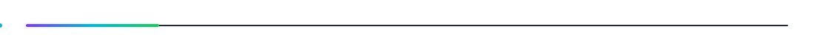

# 👋 Hi, I'm Dishant Patil

  

  

## 🎯 Companies I'm Targeting

  
  &nbsp;&nbsp;&nbsp;&nbsp;
  
  &nbsp;&nbsp;&nbsp;&nbsp;
  
  &nbsp;&nbsp;&nbsp;&nbsp;
  
  &nbsp;&nbsp;&nbsp;&nbsp;
  
  &nbsp;&nbsp;&nbsp;&nbsp;
  

  Google • Microsoft • Amazon • Apple • Meta • Netflix

  

## 🧠 What I'm Building

- **CivicScan** — computer-vision based road hazard / encroachment detection
- **Student Analytics** — role-based academic analytics and reporting platform
- **Student Skill-to-Career Matcher** — skill-gap and career compatibility system
- **DSA Practice** — pattern-based C++ problem solving and interview preparation

## 🛠️ Stack

  

## 📈 GitHub Activity

  

  

## 🔄 Weekly Progress

Every week, the skill matrix is updated from the latest self-assessment. The goal is to track **real engineering growth**, not just collect badges.

**Tracked areas:** C++ • DSA • Problem Solving • OOP • CS Fundamentals • DBMS/SQL

  

<i>Building every week. Solving every day. 🚀</i>

